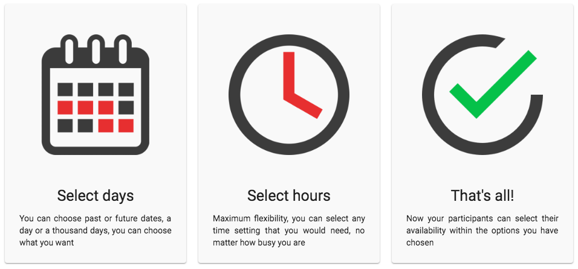
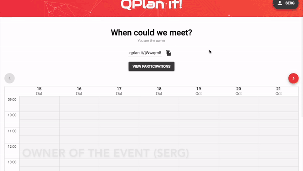
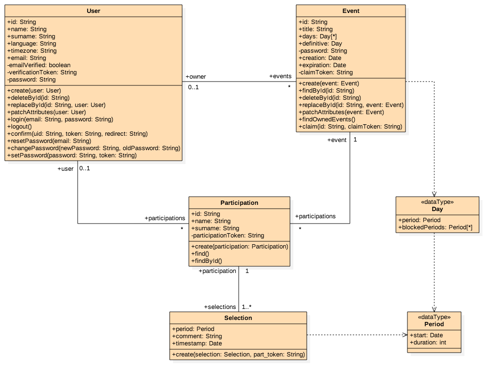
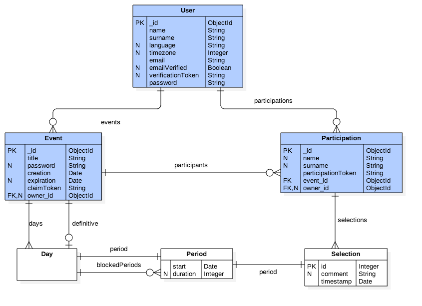

# QPlan it!

This is a project that facilitates the planning of events, helping to decide when is the best time to hold a meeting between a few friends or an international event with thousands of participants.

+ **Check out the developer preview in [qplan.it](http://qplan.it)**

The differentiating feature is the flexibility, allowing you to choose any time configuration and your participants to select their availability within the available days.

## Event demostration
Here you can see the flexibility that the participants have to select their availability, and how the calendar would look after 3 participations.

## Class diagram for the backend

## ERD diagram for the database
This project is using MongoDB as database, so there is no SQL relations, but it represents how each of the database entities (blue) and data types (white) are related.

## TODO
This project is still not finished, it would be necessary to complete the following objectives before the release version:

- [ ] Represent correctly the overlapping of time slots in the event calendar
- [ ] Implement user panel (mockups [here](doc/mockups.pdf))
- [ ] Allow to edit event in the frontend
- [ ] Allow to select definitive day and notify participants
- [ ] More exhaustive request verification in the backend
- [ ] Some optimizations when consulting participations
